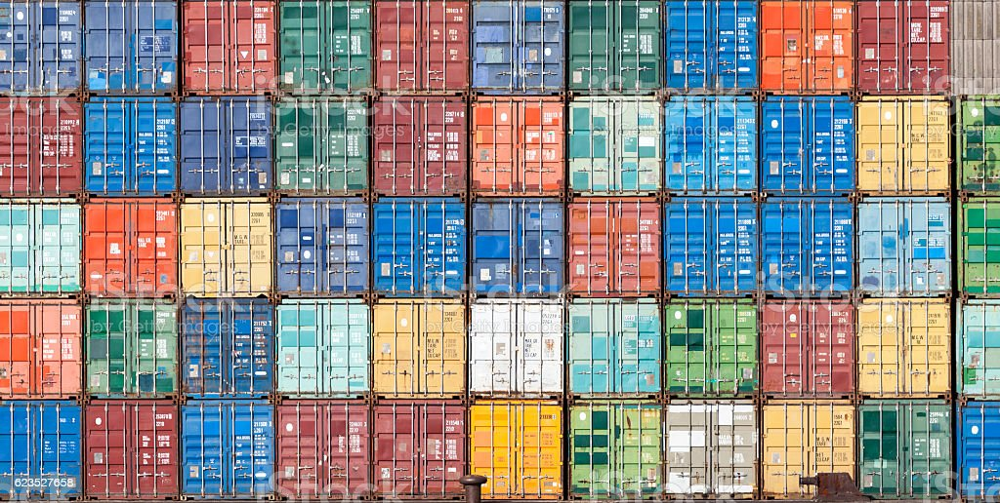

# C++ Containers

In this project, the task was to write from scratch their own containers, namely: Vector, Map, Stack, Set
Using the documentation on cppreference and cplusplus.com, a scope of work was defined which covers everything from custom constructor calls, overloading operators and functions, to using SFINAE in more narrowly focused places

## Technologies

1. C++

## Vizualization

  
